<!-- Generated by GitHub Profile Agent Console. Edit profile.config.json, then run npm run generate. -->

  <picture>
    <source media="(max-width: 760px) and (prefers-color-scheme: dark)" srcset="./assets/hero/agent-console-20935ea0-mobile-dark.svg">
    <source media="(max-width: 760px)" srcset="./assets/hero/agent-console-20935ea0-mobile-light.svg">
    <source media="(prefers-color-scheme: dark)" srcset="./assets/hero/agent-console-20935ea0-dark.svg">
    <source media="(prefers-color-scheme: light)" srcset="./assets/hero/agent-console-20935ea0-light.svg">
    
  </picture>

  

## About Me

I build practical web applications using Laravel, PHP, Java, and modern web technologies while continuously improving my software engineering skills.

## Current Focus

| Area | What I am exploring |
| --- | --- |
| **Laravel** | Backend web development with Laravel, REST APIs, authentication, database integration, and scalable application architecture. |
| **PHP** | Server-side web development, database integration, authentication, and building practical backend applications. |
| **REST APIs** | Designing, building, testing, and integrating reliable RESTful APIs for modern web applications. |
| **AI Integration** | Integrating AI capabilities into practical web applications to improve automation, user experience, and developer workflows. |

## Featured Work

| Project | Focus | Why it matters |
| --- | --- | --- |
| [**SkillSpan**](https://github.com/SkillSpan/Back-End) | Laravel Backend / REST API / Authentication | A Laravel-based job readiness platform that helps students and graduates evaluate their skills, connect with organizations, and improve their career readiness through structured assessments and opportunities. [Live](https://skillspan-iota.vercel.app/) |
| [**ClinicDesk Gaza**](https://github.com/AhmedSaqllah2005/clinicdesk-) | Laravel / Full-Stack / Database | A practical web application designed to manage clinic operations, organize patient information, and streamline daily workflows through a simple and efficient digital system. |

## Research Direction

I am interested in building reliable web systems and exploring how AI can make software more capable, useful, and autonomous while keeping actions controlled and understandable.

## Tech Stack

`Laravel` · `PHP` · `Java` · `JavaScript` · `MySQL` · `REST APIs` · `HTML` · `CSS`

## Recent Activity

<!-- AUTO:ACTIVITY:START -->
- Sep 29, 2026: pushed 1 commit to [SkillSpan/Back-End](https://github.com/SkillSpan/Back-End).
- Sep 27, 2026: pushed 1 commit to [SkillSpan/Back-End](https://github.com/SkillSpan/Back-End).
- Sep 25, 2026: pushed 1 commit to [SkillSpan/Back-End](https://github.com/SkillSpan/Back-End).
- Sep 25, 2026: closed pull request [#22](https://github.com/SkillSpan/Back-End) in [SkillSpan/Back-End](https://github.com/SkillSpan/Back-End).
- Sep 25, 2026: opened pull request [#22](https://github.com/SkillSpan/Back-End) in [SkillSpan/Back-End](https://github.com/SkillSpan/Back-End).
<!-- AUTO:ACTIVITY:END -->

---

  Building practical web systems and turning ideas into working software.

